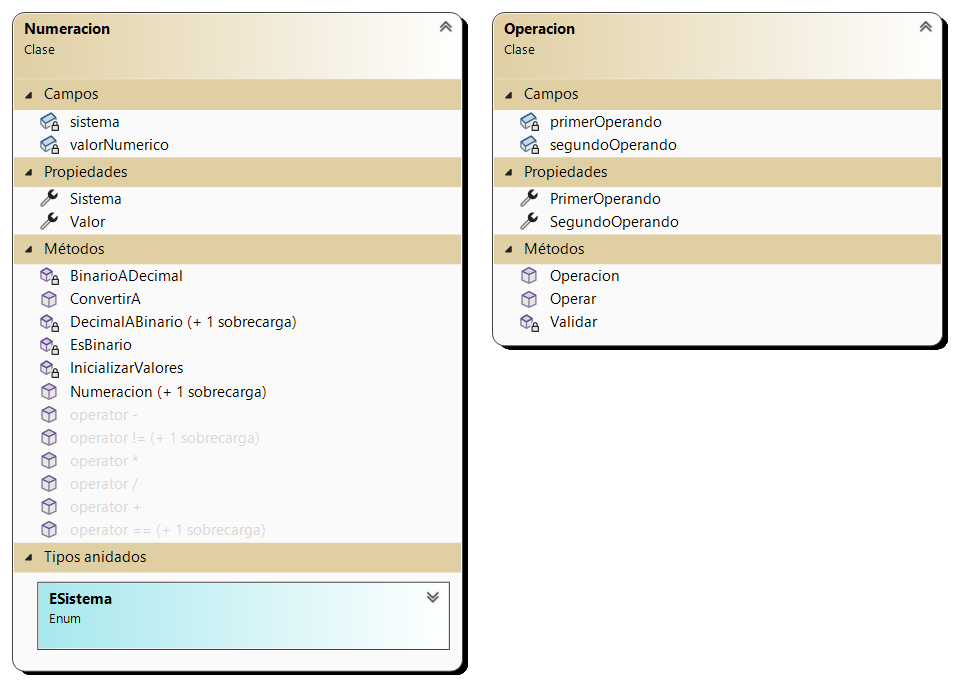

# Calculadora

El primer ejercicio integrador de **Laboratorio II** es una calculadora que realiza operaciones básicas hecha en `C#` con **Windows Forms**.
Permite realizar las operaciones de suma, resta, multiplicación y división y poder expresar el resultado tanto en **decimal** como **binario**.

## Diagrama de clases 📋

### Numeracion 

Contiene los atributos **valorNumerico** de tipo `double` y **sistema** de tipo **ESistema** junto al resto de metodos.

El **valorNumerico** representa el número ingresado por el usuario y el sistema representa el **sistema** de numeración en el que se encuentra el número (decimal o binario).

Internamente siempre trabajaremos con tipos numéricos.

### Operacion

Es la clase que contiene los métodos para realizar las operaciones. Contiene los atributos **primerOperando** y **segundoOperando** de tipo `Numeracion`.

El metodo `Operar` recibe como parámetro el operador (por defecto realiza una suma) y devuelve una `Numeracion` con el resultado de la operación.

### FrmCalculadora 

Es el formulario principal de la aplicación. Contiene los botones numéricos, de operaciones, de conversión y de limpieza. También contiene los dos **TextBox** donde se ingresan los números y el **Label** donde se muestra el resultado.

 

Aquí se encuentra el método **btnOperar_Click** que instancia un objeto de la clase `Operacion` y llama al método **Operar** de la misma.