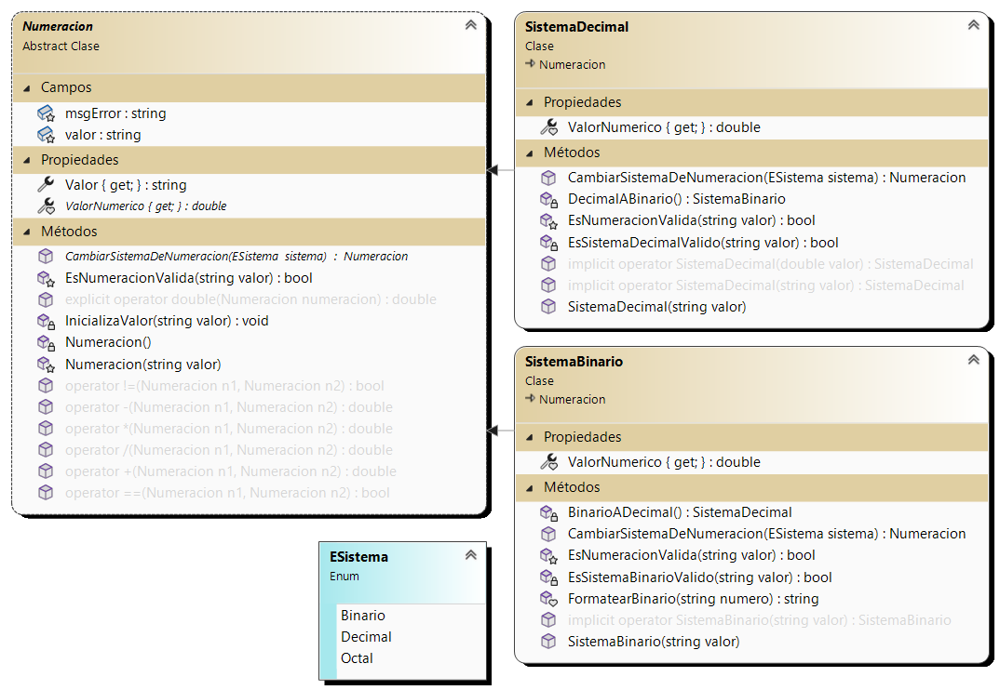
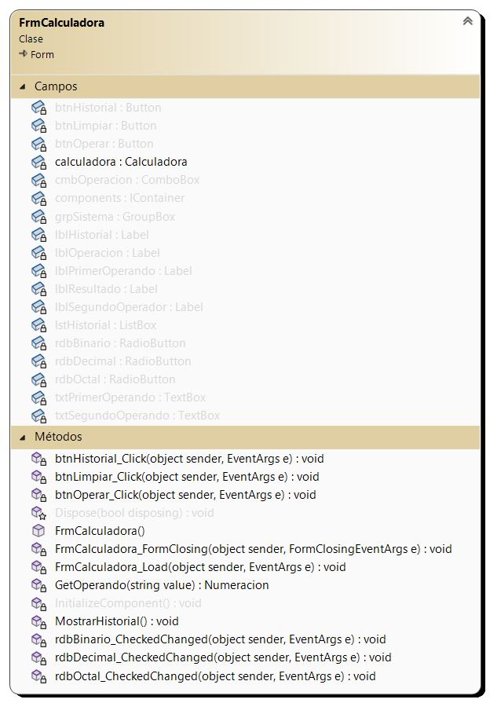

# Calculator-App: Binario-Decimal

El primer parcial de **Laboratorio II** es una calculadora que realiza operaciones básicas hecha en `C#`.

Permite realizar las operaciones de suma, resta, multiplicación y división y poder expresar el resultado tanto en **decimal** como **binario**.

Ademas, de poder acceder al historial de operaciones realizadas y poder limpiarlo.

## Diagrama de clases 📋 

Inicialmente, el proyecto contara con las siguientes clases:

- **Numeracion**
- **Sistema Decimal**
- **Sistema Binario**
- **Calculadora**

Junto a un enumerado **ESistema** que contendra los valores **Binario**, **Decimal** y **Octal** (proximamente) que representaran el sistema de la calculadora.

Ademas, se creara un formulario principal **FrmCalculadora** que contendra los botones y los campos de texto para poder realizar las operaciones.

### Numeracion

Es la clase base de la aplicación. Contiene los atributos **valor** y **msgError** ambas de tipo `string`.

El **valor** representa el valor numerico de la numeracion y **msgError** el mensaje de error que se mostrara en caso de que el valor no sea valido.

Las clases **Sistema Decimal** y **Sistema Binario** heredan de esta clase. E internamente siempre trabajaremos con tipos numéricos.

### Calculadora

Es la clase que contiene los métodos para realizar las operaciones. Contiene los atributos **primerOperando** y **segundoOperando** de tipo `Numeracion`.

El metodo `Caclular` recibe como parámetro el operador (por defecto realiza una suma) y mapea el resultado de la operación segun el sistema de la calculadora.

### FrmCalculadora

Es el formulario principal de la aplicación. Contiene los botones para realizar la operacion, revisar el historial y de limpieza para este ultimo. 

También contiene dos **TextBox** donde se ingresan los números y el **Label** donde se muestra el resultado.

